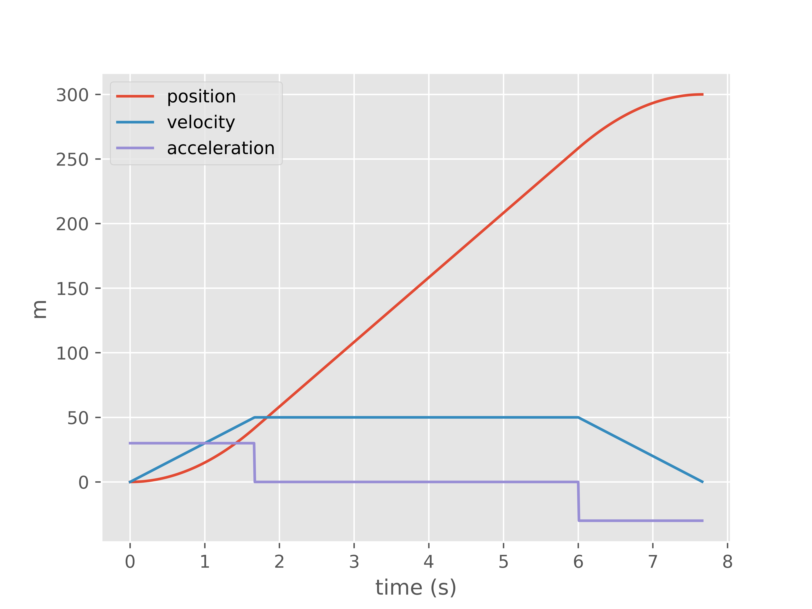

# Motion Control

#### Motion Profiling

Motion profiling is a crucial concept in control systems, particularly when it comes to ensuring smooth and efficient movement of mechanical systems. Unlike a controller, which directly influences system behavior, motion profiling is used to _generate_ position and velocity references that a controller, such as PID or a feedforward controller, will use to guide the system.

One of the key advantages of our implementation is the ability to perform _asymmetric motion profiling_. This means we can define different profiles for acceleration and deceleration phases to better match the physical characteristics and constraints of specific systems. By doing so, we achieve more refined control, efficient energy usage, and can cater to systems that require non-uniform acceleration curves.

<figure><figcaption><p>Example of a motion profiled trajectory.  Notice the trapezoid shape of the velocity. </p></figcaption></figure>

## Using the Motion Profile


```python
# instanciate profile
profile = TrapezoidProfile(
    max_accel, 
    max_decel, 
    max_vel, 
    targetDistance
)
# pseudocode, use the SystemTimeTopic within scheduler
timer = timer()
# this would be the periodic method of a Topic. 
while True:
    state = profile.get(timer.seconds())
    # unpack state variables 
    position, velocity = state.x, state.v 
    # use a control loop to follow the reference
    u = pid(position, velocity)


```


You will want to re-instanciate the profile upon changes to targetDistance.  You can keep a running value and if the previous value is not equal to the current value then you regenerate. &#x20;


